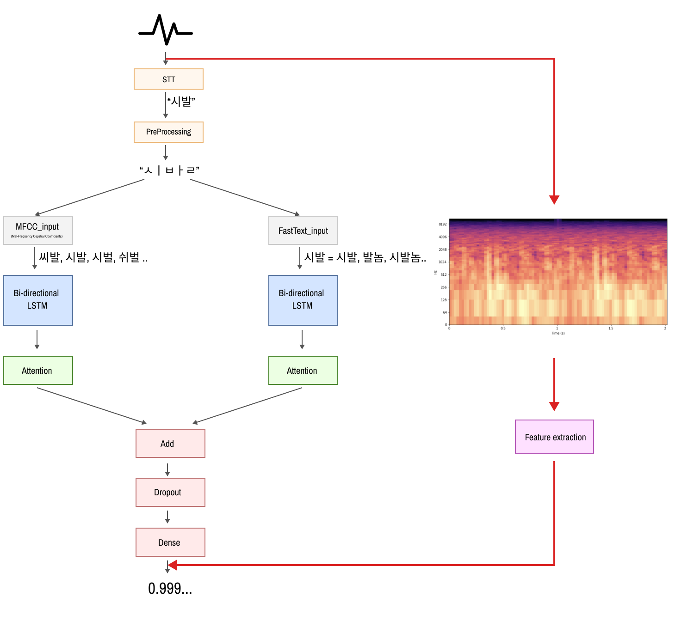

# PVMM


<br><br>

## ✔목차
* [프로젝트 정보](#프로젝트-정보)
* [프로젝트 소개](#프로젝트-소개)
* [팀원 소개](#팀원-소개)
* [시작 가이드](#시작-가이드)
* [기술 스택](#기술-스택)
* [Ref](#ref)
* [Kind_Words_Cloud Ref](#kind_words_cloud-ref)

<br><br>

## 🔎프로젝트 정보
> 동아대학교 컴퓨터공학과 학생 팀  
> 개발 기간: 2023.07.14 ~

<br><br>

## 🖐프로젝트 소개
> 본 프로젝트는 2023 공개SW 개발자 대회 출품작으로, 머신러닝을 이용한 실시간 음성 한국어 욕설 필터링 시스템을 API 서비스로 제공하는 프로젝트입니다.

<br><br>

## 🙋‍♀️팀원 소개
||||||
|:---:|:---:|:---:|:---:|:---:|
|컴퓨터공학과<br>4학년|컴퓨터공학과<br>4학년|컴퓨터공학과<br>4학년|컴퓨터공학과<br>4학년|컴퓨터공학과<br>4학년|
| [김현우](https://github.com/HIT18216) | [김혜영](https://github.com/hyeyeoung) | [박성민](https://github.com/ParkSeungMin1) | [서지헌](https://github.com/MyCoooi) | [이영우](https://github.com/Dandyoung) |
|역할|PM|역할|역할|역할|

<br><br><br>

# 모델
Bidirectional-LSTM을 사용하였고 어텐션 메커니즘을 적용하여 욕설 마스킹 기능을 구현했습니다. <br>

어텐션 메커니즘의 구현은 [wikidocs 튜토리얼](https://wikidocs.net/48920)을 참고했습니다. 

모델 구조는 아래와 같습니다 ([Netron](https://github.com/lutzroeder/netron)으로 시각화)



더 자세한 내용은 [코드](https://github.com/2runo/Curse-detection-v2/blob/master/src/models.py)를 참고해 주세요.

# 데이터
[v1](https://github.com/2runo/Curse-detection)과 마찬가지로 [욕설 감지 데이터셋](https://github.com/2runo/Curse-detection-data)을 사용했습니다.

욕설 감지 데이터셋은 약 6000개의 문장에 대해 욕설 여부를 분류한 데이터셋입니다.

# 성능
| 모델 파일 | 정확도 (테스트 데이터) |
|----|----|
| weights.h5 | 89.8% |
| weights2.h5 | 90.4% |
| weights3.h5 | 90.2% |
| 앙상블 | 90.6% |

# 학습 과정
**1. 전처리**

- 연속적인 글자 단축 (ㅋㅋㅋㅋ → ㅋㅋ)
- 초성, 중성, 종성으로 분리 (안녕 → ㅇㅏㄴㄴㅕㅇ)

**2. 임베딩**

- **fasttext 임베딩**

  fasttext를 활용하여 의미 기반의 임베딩 수행
  
  이 레포지토리에선 미리 학습된 fasttext 모델을 사용합니다.
  
  때문에 예측을 위해선 fasttext 모델이 `embedding_models`폴더에 `fasttext.bin`이라는 이름으로 옮겨져 있어야 합니다.
  
  fasttext 모델은 [여기](https://drive.google.com/file/d/1AdE-_SrqF6if5BVC7QlwbZqX6HBJ8j9U/view?usp=sharing)에서 다운로드받을 수 있습니다.
  
- **mfcc 임베딩**

  비슷한 발음의 단어를 비슷한 벡터로 임베딩 (MFCC 알고리즘 활용)
  
**3. 학습**

- 데이터 불균형 문제 해결을 위해 weight balancing 기법을 적용했습니다.

# 사용법
**fasttext 모델이 `embedding_models`폴더에 `fasttext.bin`이라는 이름으로 옮겨져 있어야 합니다.**

**fasttext 모델은 [여기](https://drive.google.com/file/d/1AdE-_SrqF6if5BVC7QlwbZqX6HBJ8j9U/view?usp=sharing)에서 다운로드받을 수 있습니다.**
## 예측

```python3
from curse_detector import CurseDetector

# 아래와같이 weights_paths에 여러 모델을 적으면 앙상블 기법으로 예측할 수 있습니다.
weights_paths = ['models/weights.h5', 'models/weights2.h5', 'models/weights3.h5']

curse = CurseDetector(weights_paths)
```

욕설 여부를 분류하기 위해 `ensemble()` 함수를 사용할 수 있습니다.

`ensemble()` 함수는 욕설일 확률(0~1)을 반환합니다:
```python3
print(curse.ensemble('니입에서 짐승소리가들린다'))  # 0.78354186
```

또한 욕설을 마스킹하기 위해 `masking()` 함수를 사용할 수 있습니다.

욕설 마스킹이란 텍스트의 욕설 부분만 별표(\*) 처리하는 것을 의미합니다:
```python3
print(curse.masking('옷 다릴 때 니 뇌도 같이 다렸니?'))  # '* * 때 니 *도 같이 다렸니?'
```
## 학습
학습을 위해 실행해야 할 파이썬 파일의 순서는 다음과 같습니다.

1. embedding.py : 데이터 임베딩을 수행합니다. (임베딩된 데이터는 `dataset` 폴더에 저장됩니다)

2. train.py : 모델을 학습합니다. (학습된 모델은 `models` 폴더에 저장됩니다)


## 📝Ref
https://github.com/2runo/Curse-detection-v2

<br><br>

## 📝Kind_Words_Cloud Ref
[노션 링크](https://wry-legal-ca8.notion.site/673bdf0c2b0f4ca380ca18f68aaf5672?pvs=4)
